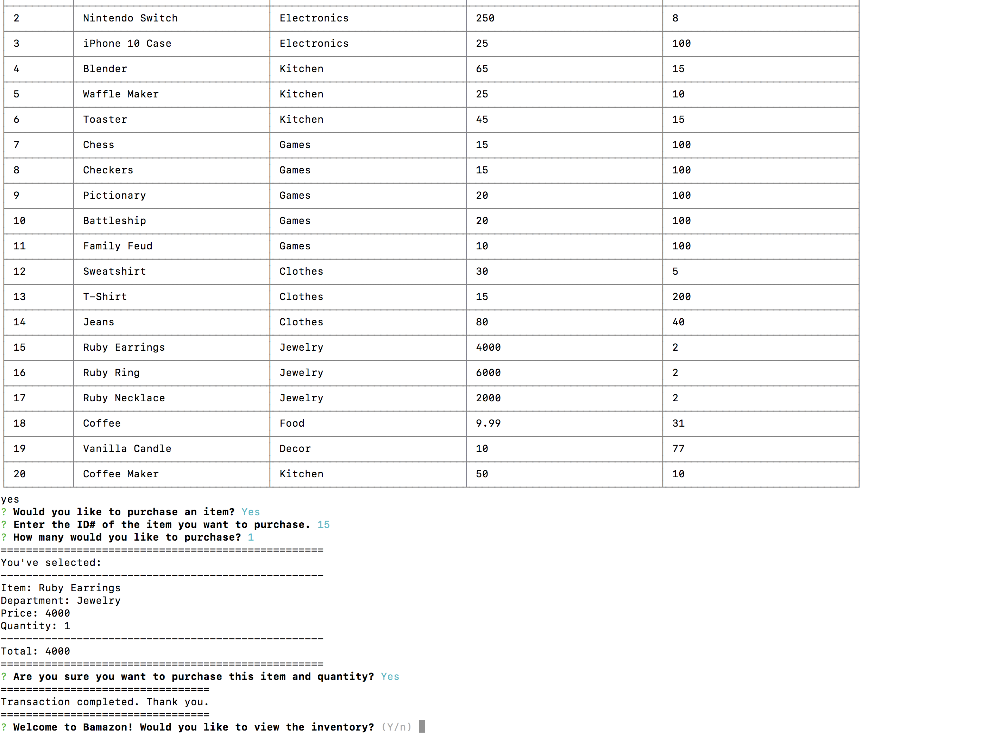

# bamazon

#### This is a node js CLI Amazon-like storefront with the MySQL. 
* main execution of program is within 
* bamazonCustomer.js and bamazonManager.js

##### bamazonCustomer.js
* This app taked in orders from customers and depleted stock from the store's inventory. 
* Data is stored in a MySQL Database called bamazon 
* with a products table.
* Running this application will display all of the items available for sale. 
* User is prompted 
    * for ID of the product they would like to buy.
    * for how many units of the product they would like to buy.
* Once the customer has placed the order, the app checks if there is enough of the product to meet the customer's request.
    * If not, warn the user, prevent the order from going through, restart the prompt
    * If enough, fulfill the customer's order.
            * Update DB with new quantity 
            * show the customer the total cost of their purchase.

##### bamazonManager.js
* List a set of menu options:
    * View Products for Sale
        * list every available item: the item IDs, names, prices, and quantities
    * View Low Inventory
        * list all items with an inventory count lower than five
    * Update Inventory
        * display a prompt that will let the manager "update the quantity" of any item currently in the store
    * Add New Product
        * allow the manager to add a completely new product to the store

#### Dependencies
 * npm inquirer